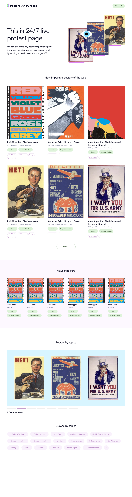

# Posters with Purpose 🗽

---
## Description ✍🏽
---

*__Posters with Purpose__* is a platform for graphic designers and artists to publish and distribute meaningful posters. Visitors of the website would be able to print creations in high quality and order them from a print center. They can also donate some arbitrary amount of money to the creator and in exchange receive an NFT into their wallet, that they might want to collect, use as a pfp or keep for a good memory.

---
## Link to the website 🔗
---

[posterwithpurpose.com](https://posterwithpurpose.com)

---
## Motivation 💪🏽
---

In the current world, humanity is lost in truth with all informational wars happening on tv, internet and social media. Throughout the history graphic designers were creating meaningful artistic peaces that were exposed in the environment where others would be able to see and reflect on them. Unfortunately this format is not much in the favor these days and is mostly used for commercial advertising, but we’ve seed the format powerfully used to communicate some ideas, protest and express humanity feelings. Posters of this kind are still heavily used during political manifestations and that’s where all the creative ones can be seen.

When the conflict between Russia and Ukraine has started many people were in Ukraine, Russia and Belarus and were not able to express themselves due to risk of their life, health and freedom. Though many people of those nations living abroad were going out in the streets in the other countries to express theirs opinions. Posters sometimes are so creative that many people would want to have a photo or even walk with them on the streets where they feel deeper connection with the values expressed.

There are also cases where people would not be able to express themselves due to their social and religious environment.

---
## Solution 💡
---

Unstoppable decentralized applications for people to express freely, anonymously where needed. Platform where people would be able to come, get inspiration, express themselves,  support each other and spread the word. 

---
## Where the project fits 📍
---

Diagram with poaps, nfts, soulbounds.

The project is seeking to rediscover the format and possibly onboard new audience into decentralized space, targeting graphic designers, activists and creatives that might stayed away due to speculative nature of nfts and crypto in general. Posters with Purpose is looking to rediscover nfts as collectables and memories for people. It is a speculation on the hype over scarce nfts and making profits, bringing abundance into the focus, which is needed to share and spread the knowledge and views. Another issue that might be addressed is inherited curation, where in the space there is so much discussion what is art and what is not, here everything is curated by having a message or purpose. 

All of the creations uploaded to PwP are licensed with CC0 license.It’s amazing that there are so many beautiful posters created that lie in the public domain and can be uploaded to the platform and collected by people.

---
## How it works ⚙️
---

Users sign up on the platform using their crypto wallet, they are able to upload creations and specify whether they are the creator and would want to receive donations or if the creation is in the public domain they can specify original author, donations in this case would be sent to DAO address, that would distribute any donations to social impact organizations. 

Collectors are able to view all of the creations by topic and upload timestamp. Whether they find the work they like, they are free to print creation in a good quality, they can also choose to make any value donation to original creator/dao and receive an NFT as a gift to their wallet. In the future those nfts can be used for token gated communities.

By printing posters collectors also curate the platform, eventually making a page kind of live protest page that is working 24/7 as posters are sorted by number of prints made in the past time. They can also choose to upload photos of posters placed in the environment completing so called “Proof of Use”

---
## Tech stack 📟
---

Zora for nft minting, displaying

Rainbowkit for wallets management, Wagmi for web3 integration

Nft storage for media storage

IPFS for website hosting

Ethereum for smart contracts handling

Firebase for realtime database, to be exchanged for Ceramic as soon as indexing is live.

---
## Tech details 👨🏽‍💻
---
Updates to zora

- Lazy mint, Non geeks welcome, only wallet needed. Creator only needs to sign a message. Collector would be consuming original details and signature and creating edition and minting nft while making donation
- Arbitrary value to donate on nft mint

---
## Project is live and open source 📭
----
QR code, link, feel free to connect if you like the idea and want to work further on it.

---
## Objectives 🎯
---
We want to create a platform that would be used by creatives to express their views on things currently happening in the world, visitors would be able to reflect by printing posters, putting them on the walls, in the streets and other environments. Impressions that each creation would be generating would be used as curation mechanism, thus we would be able to display what’s currently the most “hot” poster/idea that attracts the attention leading the platform to be a kind of live protest page 24/7

---
## Mockups 📸
---
### __Landing Page__
        
Where you will be able to see the top trending posters of the week, the newest and search by category.
    

### __Topic Filter__

You can look for posters related to some specific topics or category

### __A poster page__

When you go on the a poster's page you can see more informations about it, such as pictures that users uploaded while using the posters or the different addresses that supported the creator for exemple.

### __Uploading a proof of use picture__

As said before you can upload a picture of you using the poster.

### __Consulting a profile__

You can consult the profile of a person to see all their different creations or the posters that they printed or supported.

---
---

## To see more of the mockups or screenshots of the website please consult the [screenshots](https://github.com/Hacking-Web3/poster-with-purpose/tree/main/screenshots) folder :)